# BluePrint User Guide for Linux Machine

# Changelog
  
| Version | Date       | Description              | Author       |
| ------- | ---------- | ------------------------ | --------------- |
| 0.1     | 28/12/2021 | First version | Maikal Kumar |

# Table of Contents

[BluePrint User Guide for Linux Machine
1](#blueprint-user-guide-for-linux-machine)

[Introduction 3](#introduction)

[Purpose 3](#purpose)

[Audience 3](#audience)

[Scope 3](#scope)

[How to deploy a VM using blueprint 3](#_Toc90593289)

[1. VM Deployment in DHC Cloud 4](#vm-deployment-in-dhc-cloud)

[1.1 General Page 4](#login-to-vra-cloud)

[1.2 Deployment Details 4](#deployment-details)

[1.3 Local Account 6](#local-account)

[1.4 Additonal Disk Details 7](#additonal-disk-details)

[1.5 Additional NICs Details 8](#additional-nics-details)

[1.6 Form Validation 8](#form-validation)

[2. VM Deployment in AZURE Cloud 9](#vm-deployment-in-azure-cloud)

[2.1 General Page 9](#general-page)

[2.2 Deployment Details 10](#deployment-details-1)

[2.3 Local Account 11](#local-account-1)

[2.4 Additonal Disk Details 12](#additonal-disk-details-1)

[2.5 Additional NICs Details 13](#additional-nics-details-1)

[2.6 Form Validation 13](#form-validation-1)

[3. Edit/Delete the VMs 14](#public-private-key-base-authentication)

[4. Verify the Vms 15](#_Toc90593305)

[5. Troubleshoot the VMs 15](#_Toc90593306)

# Introduction

Blueprinting service Catalog item in a vRA service broker lets end user
easily deploy virtual server in required cloud endpoint (DHC, Azure,
Etc).

# Purpose

How to use vRA service broker to deploy VMs

# Audience

This document is intended for customers or End users who are responsible
to deploy VMs using vRA blueprint.

# Scope

The scope of this document covers the following:

  - Deploy the VMs using Blueprint

  - Select appropriate cloud end point

  - Select appropriate size, disks, NICs and flavours

# VM Deployment in DHC Cloud

> The Blueprint catalog form is multipage form. End users need to
> Navigate through each page step by step to provide the required
> information, also for every field there is information button which
> gives additional information based on field.

## Login to vra cloud

> Please get in touch with DHC operations to get credentials for vRA
> cloud console.
> 
> Login to vRA cloud portal -
> <https://console.cloud.vmware.com/csp/gateway/discovery>
> 
> 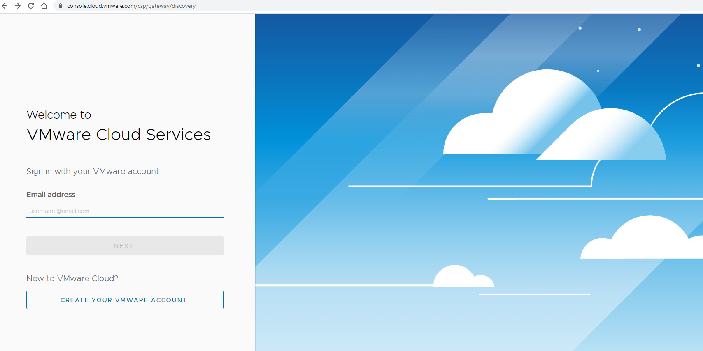
> 
> Navigate to Service Broker-\>Catalog.
> 
> 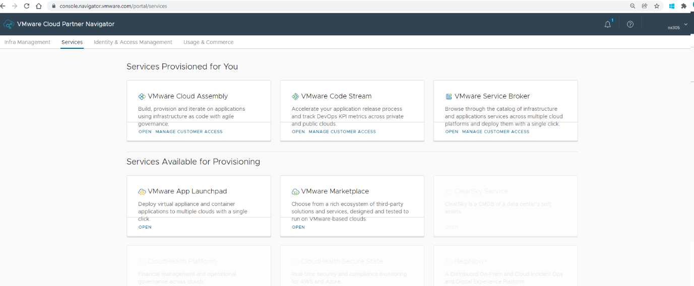
> 
> Make sure proper organization is selected.
> 
> Select Deploy Linux VM Catalog item.
> 
> 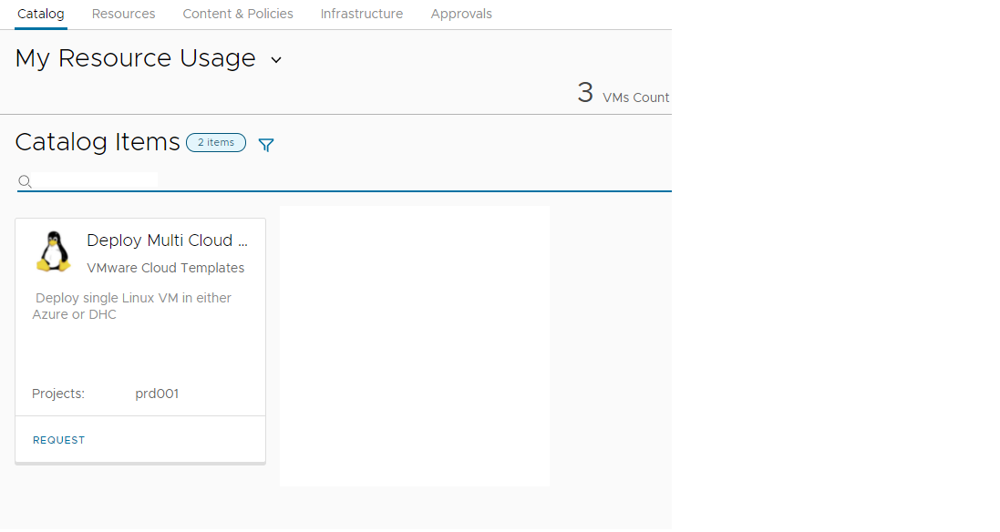

## General Tab

  - On this page users can select the required **Cloud Account** (eg.
    DHC, AZURE) where user want to deploy VM.

  - Based on the selected cloud account, additional pages will get
    populated.

  - Additional pages will capture required information for VM
    provisioning on given cloud account.

| **Screenshots**                 |
| ------------------------------- |
| 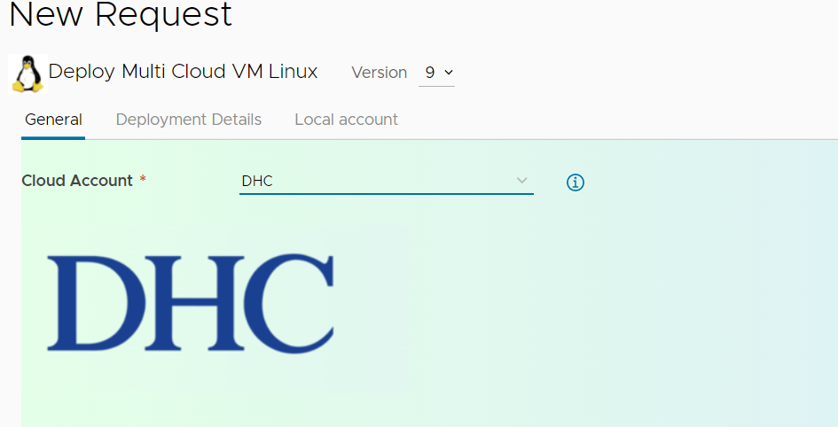 |

## Deployment Details

  - This page will take all the necessary input to deploy the Virtual
    Machine, also user can deploy multiple VMs as per requirement.

  - Form element dropdown value will be populated based on the selection
    of Cloud Account

<table>
<thead>
<tr class="header">
<th><strong>Screenshots</strong></th>
</tr>
</thead>
<tbody>
<tr class="odd">
<td>
  
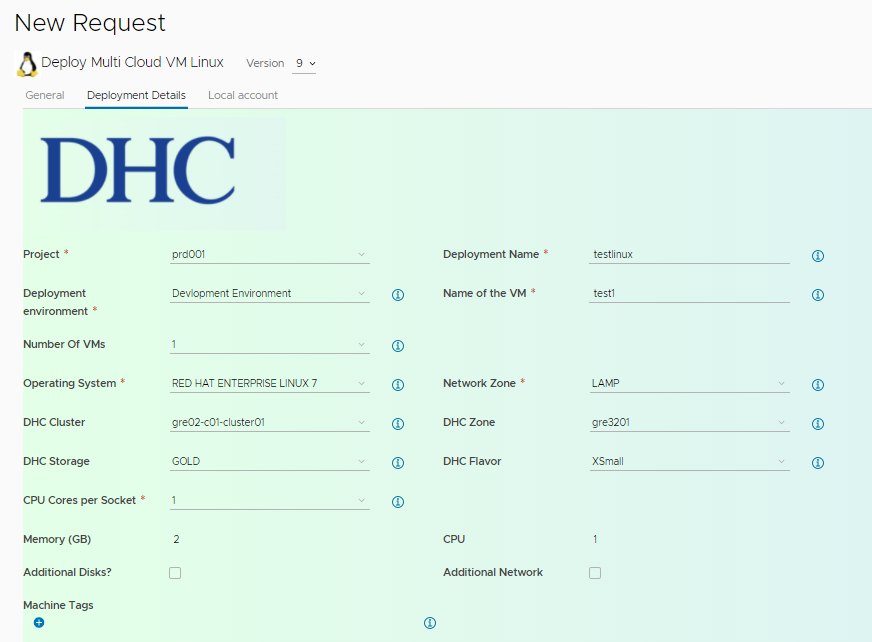

  
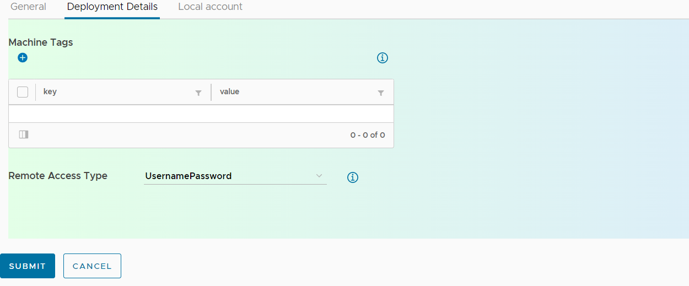

 </td>
</tr>
</tbody>
</table>

<table>
<thead>
<tr class="header">
<th>Field Name</th>
<th>Description</th>
</tr>
</thead>
<tbody>
<tr class="odd">
<td><strong>Project</strong></td>
<td>User need to select project as per contract (eg prd001)</td>
</tr>
<tr class="even">
<td><strong>Deployment Environment</strong></td>
<td>Based on the roles and requirement User need to select the Environment in which VM will be deployed. The environment can vary according to organization.</td>
</tr>
<tr class="odd">
<td><strong>Deployment Name</strong></td>
<td>Enter the valid unique deployment name</td>
</tr>
<tr class="even">
<td><strong>VM Name</strong></td>
<td>Enter any valid name of VM, prefix will be added in backend based on Deployment Environment Eg: <strong>Test-deploymentname.</strong></td>
</tr>
<tr class="odd">
<td><strong>No of VMs</strong></td>
<td>Users need to enter the no of VMs gets deployed. User can configure the default and maximum limit based on customer requirements; current limit is set to 5</td>
</tr>
<tr class="even">
<td><strong>Operating System</strong></td>
<td>Users need to select the available Linux operating system to deploy on the VM eg <strong>REDHAT ENTERPRISE LINUX 7.</strong> List can be configured according to customers need and templates supported by DHC.</td>
</tr>
<tr class="odd">
<td><strong>Network Zone</strong></td>
<td>Users need to select available network zone from the list eg: <strong>LAMP</strong>, <strong>SAP</strong>, <strong>TRUSTED</strong>. The Zone names can be customized based on customer requirement.</td>
</tr>
<tr class="even">
<td><strong>Cloud Zone</strong></td>
<td>Users need to select available cloud zone from the list eg: <strong>gre3201</strong></td>
</tr>
<tr class="odd">
<td><strong>Cluster Name</strong></td>
<td>
based on the cloud zone cluster name will be automatically populated.

In case if customer have more than 1 cluster in given cluster zone, then this field will have dropdown list accordingly.
</td>
</tr>
<tr class="even">
<td><strong>Storage Type</strong></td>
<td>user need to select available standard storage type from the list for eg available options are <strong>Gold</strong>, <strong>Silver</strong>, <strong>Dimond</strong>. This list can be configured based on customer need.</td>
</tr>
<tr class="odd">
<td><strong>VM Size</strong></td>
<td>Users need to select available standard DHC VM Size from the list for eg <strong>Small, Xsmall, medium, Large, XLarge.</strong> Each size has memory and CPU associated with it.</td>
</tr>
<tr class="even">
<td><strong>Memory</strong></td>
<td>Based on the VM Size, memory will be populated</td>
</tr>
<tr class="odd">
<td><strong>CPU</strong></td>
<td>Based on the VM Size, CPU will be populated</td>
</tr>
<tr class="even">
<td><strong>Machine Tag</strong></td>
<td>Enter the Machine tag with key value pair which will help to find the resource based on tag.</td>
</tr>
<tr class="odd">
<td><strong>Additional Disks</strong></td>
<td>If user want to add additional disks, user can select the checkbox then new page will be populated to enter the Additional disk info.</td>
</tr>
<tr class="even">
<td><strong>Additional Networks</strong></td>
<td>If user want to add additional network, user can select the checkbox then new page will be populated to enter the Additional NICk info</td>
</tr>
<tr class="odd">
<td><strong>Remote Access Type</strong></td>
<td>Here user need to select the way user will login newly deployed VMs. Eg. <strong>usernamePassword</strong>. <strong>generatedPublicPrivateKey</strong></td>
</tr>
</tbody>
</table>

## Local Account

  - This page will let us set the username and password using which user
    will access deployed VMs.

  - Guidelines for Username and password  
    **username**: anything between 5-12 characters  
    **password**: anything according to below policy**  
    minLength:** 12  
    **maxLength**: 18  
    **pattern**: '\[a-z0-9A-Z@\#$\]+'

| **Screenshots**                 |
| ------------------------------- |
| 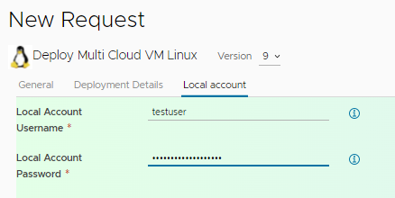 |

## Additonal Disk Details

  - This page takes information to add new disk, to add new disk click
    on plus symbol (**+**) new form will populate to enter below
    details.

  - **Name of this Disks**: The name should be unique.

  - **Size of the Disk (GB)**: it should be only in numbers.

  - **Storage Class**: It will let select standard available storage
    profile.

  - **Mount Point**: For each additional disk user can enter mount point
    which will be created inside VM, system default mount points and
    duplicate mount points are not allowed and during validation it will
    show error for same.

  - **Format Disk**: For all additional disks user will have option to
    format those disks.

> **Note**: Maximum number of disks will be will visible below the disk
> tables.

| **Screenshots**                 |
| ------------------------------- |
| 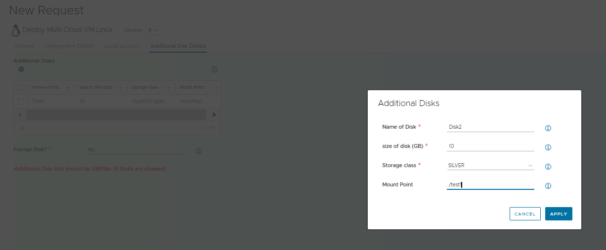 |

## Additional NICs Details

  - This page takes info to add new additional network, to add new
    additional NIC, click on plus symbol (**+**) new form will populate
    to enter below details.

  - **NIC Name**: it should be valid unique name.

  - **Network Profile for Each NIC**: user can select required Profile
    according to their need.

> **Note**: Maximum NIC will be will visible below the NIC tables.

| **Screenshots**                 |
| ------------------------------- |
|  |

# VM Deployment in AZURE Cloud

> The Blueprint catalogue form is multipage form. End users need to
> navigate each page step by step to provide the required VM
> information.

## General Page

  - This page let user select the **Cloud platform** (eg. DHC, AZURE)
    where they want to deploy the VMs

  - Based on the selected Platform, new page gets populated with
    required input elements for VM Deployment.

| **Screenshots**                  |
| -------------------------------- |
| 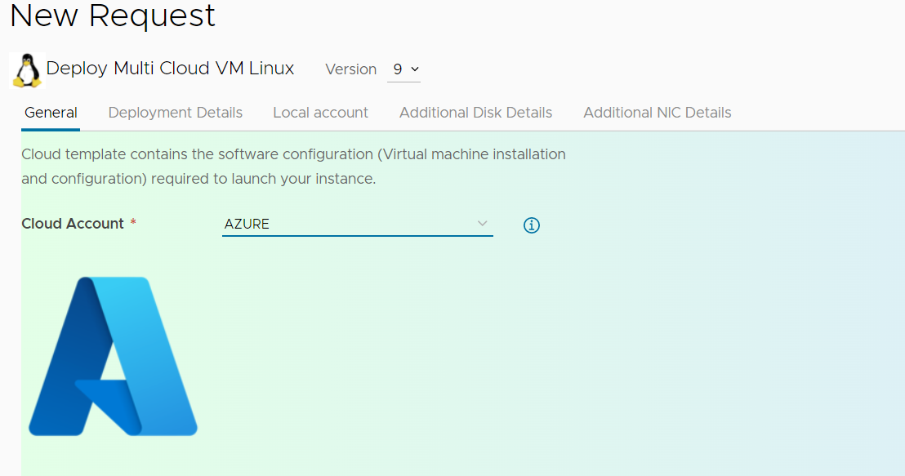 |

## Deployment Details

  - This page will take all the necessary input to deploy the Virtual
    Machine.

  - Below is the required info user need to provide.

> **Note**: Form element dropdown value will be populated based on the
> selection of Cloud Account ie. **DHC** or **Azure**.

| Field Name                 | Description                                                                                                                                                                                                                                                                                                                                                                                                                              |
| -------------------------- | ---------------------------------------------------------------------------------------------------------------------------------------------------------------------------------------------------------------------------------------------------------------------------------------------------------------------------------------------------------------------------------------------------------------------------------------- |
| **Project**                | Users need to select project as per contract (eg prd001)                                                                                                                                                                                                                                                                                                                                                                                 |
| **Deployment Environment** | Based on the roles and requirement User need to select the Environment in which VM will be deployed. The environment can vary according to organization.                                                                                                                                                                                                                                                                                 |
| **Deployment Name**        | Enter the valid unique deployment name                                                                                                                                                                                                                                                                                                                                                                                                   |
| **VM Name**                | Enter any valid name of VM, prefix will be added in backend based on Deployment Environment Eg: **Test-deploymentname.**                                                                                                                                                                                                                                                                                                                 |
| **Operating System**       | Users need to select the available Linux operating system to deploy on the VM eg **REDHAT ENTERPRISE LINUX7.** List can be configured according to customers need.                                                                                                                                                                                                                                                                       |
| **Cloud Region**           | The available region will be populated as per users subscription.eg **aznortheurope**                                                                                                                                                                                                                                                                                                                                                    |
| **Cloud Zone**             | The available zone will be populated as per users subscription.eg **aznortheurope**                                                                                                                                                                                                                                                                                                                                                      |
| **Storage Type**           | Users need to select available standard azure storage type from the list for eg **Standard SSD**, **Standard HDD**, **BLOB.** This list can be configured based on customer need.                                                                                                                                                                                                                                                        |
| **VM Size**                | Users need to select available standard azure VM Size from the list for eg **Standard\_DS1\_V2**, **Standard\_F2s\_V2.** Each size has memory and CPU associated with it. the standard azure VM sizes SKUs are available for a particular subscription in azure depending upon any policy or limit set for that subscription. Please check your azure subscription for available VM sizes and modify the vRA list of images accordingly. |
| **Memory**                 | Based on the VM Size, memory will be populated                                                                                                                                                                                                                                                                                                                                                                                           |
| **CPU**                    | Based on the VM Size, CPU will be populated                                                                                                                                                                                                                                                                                                                                                                                              |
| **Machine Tag**            | Enter the Machine tag with key value pair which will help us to find the resource based on tag.                                                                                                                                                                                                                                                                                                                                          |
| **Resource Group**         | Users need to choose the resource group in under which user need to deploy the VM                                                                                                                                                                                                                                                                                                                                                        |
| **Cloud Region**           | Select appropriate cloud region.                                                                                                                                                                                                                                                                                                                                                                                                         |
| **Additional Disks**       | If user wants to add additional disk, user can check the checkbox then new page will be populated to enter the Additional disk info.                                                                                                                                                                                                                                                                                                     |
| **Additional Networks**    | If user want to add additional network, user can check the checkbox then new page will be populated to enter the Additional NICk info                                                                                                                                                                                                                                                                                                    |
| **Remote Access Type**     | **:** Here user need to select the way user will login newly deployed VMs. Eg. **usernamePassword**.                                                                                                                                                                                                                                                                                                                                     |

<table>
<thead>
<tr class="header">
<th><strong>Screenshots</strong></th>
</tr>
</thead>
<tbody>
<tr class="odd">
<td>
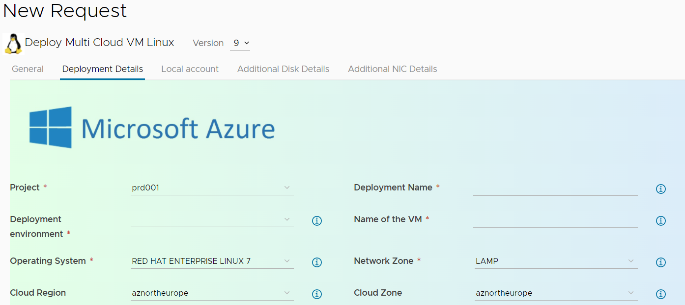

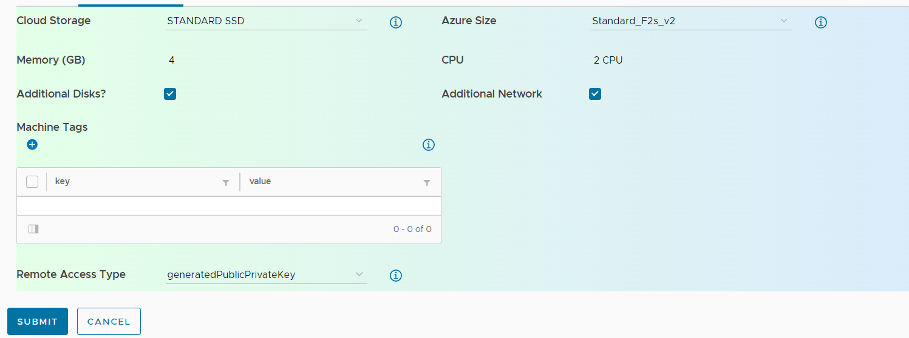
</td>
</tr>
</tbody>
</table>

## Local Account

  - This page will let us set the username and password using which user
    will access deployed VMs.

  - Guidelines for username and password  
    **username**: anything between 5-12 characters  
    **password**: anything according to below policy**  
    minLength:** 12  
    **maxLength**: 18  
    **pattern**: '\[a-z0-9A-Z@\#$\]+'

| **Screenshots**                 |
| ------------------------------- |
|  |

## Additonal Disk Details

  - This page takes info to add new disk, to add new disk click on plus
    symbol (**+**) new form will populate to enter below details.

  - **Size of Disk (GB)**: It should be only numbers.

  - **Name of this Disks**: The name should be unique.

  - **Storage Class**: It will let select standard available storage
    profile.

**Note**: Maximum number of disk will be will visible below the disk
tables.

| **Screenshots**                  |
| -------------------------------- |
| 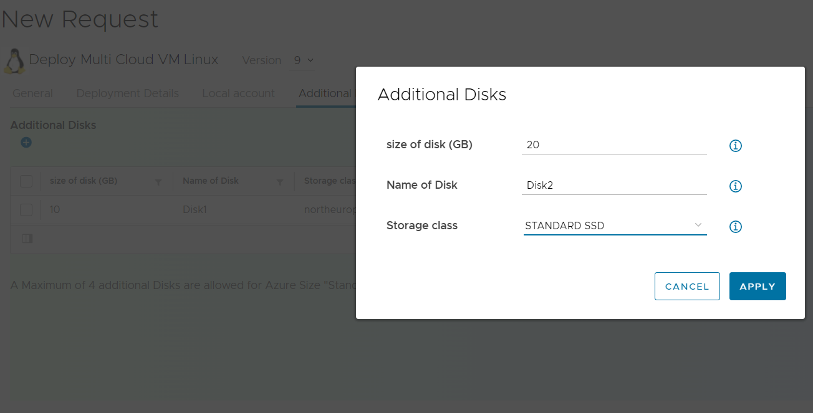 |

## Additional NICs Details

  - This page takes info to add new additional network, to add new
    additional NIC, click on plus symbol (**+**) new form will populate
    to enter below details.

  - **NIC Name**: it should be valid unique name.

  - **Network Profile for Each NIC**: User can select required Profile
    according to our need.

> **Note**: Maximum NIC will be will visible below the NIC tables.

| **Screenshots**                  |
| -------------------------------- |
| 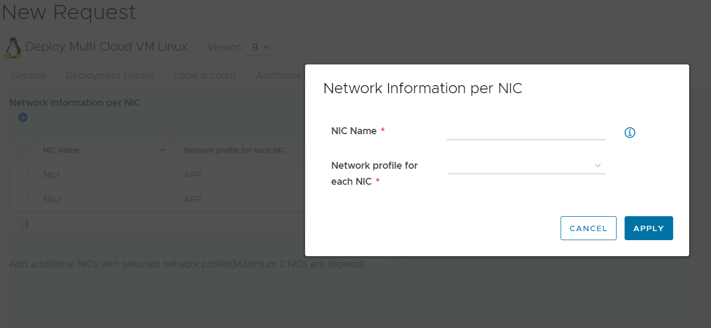 |

## Form Validation

  - After providing the required information, user need to click on
    submit button to deploy the VM. Before deployment starts it will
    validate below provided information. If provided information is
    proper then it will start deploying and redirect us to deployment
    page otherwise it will show validation massage on the top of form.

  - Below form element will be verified before submitting the request.  
    **Additional Disk:** Additional disk can’t be more the specified
    limit.  
    **Additional NICs:** Additional NICs can’t be more than specified
    NICs.

| **Screenshots**                  |
| -------------------------------- |
| 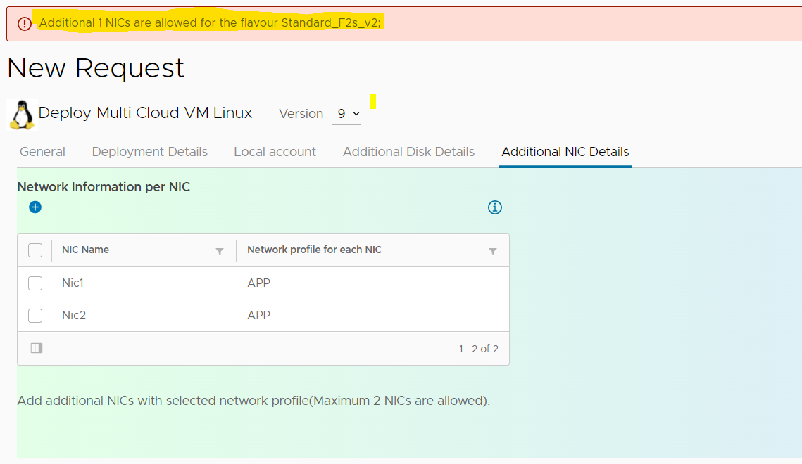 |

# Public private key based Authentication

  - This authentication method uses public private key based Authentication that is
    generated by vRA during provisioning for user login. Use following
    steps for this method:

  - Select this authentication method during provisioning.2.

  - The vRA will generate public key which will be copied to deployed VM
    under user settings.

  - User can go to provisioning page in vRA Service broker and select
    option under machine as "get Private key"

  - This will download the private key to user's machine in .pem format.

  - use this key for login to the VM
