# BluePrint User Guide for windows Machine

# Changelog
  
| Version | Date       | Description              | Author       |
| ------- | ---------- | ------------------------ | --------------- |
| 0.1     | 28/12/2021 | First version | Maikal Kumar |

# Table of Contents

[BluePrint User Guide for windows Machine
1](#blueprint-user-guide-for-windows-machine)

[Introduction 3](#introduction)

[Purpose 3](#purpose)

[Audience 3](#audience)

[Scope 3](#scope)

[1. VM Deployment in DHC Cloud 3](#vm-deployment-in-dhc-cloud)

[1.1 LOGIN TO VRA CLOUD CONSOLE 3](#login-to-vra-cloud-console)

[1.2 General tab 5](#general-tab)

[1.3 Deployment Details 6](#deployment-details)

[1.4 Local Account 7](#local-account)

[1.5 Additonal Disk Details 8](#additonal-disk-details)

[1.6 Additional NICs Details 9](#additional-nics-details)

[1.7 Form Validation 10](#form-validation)

[2. VM Deployment in AZURE Cloud 10](#vm-deployment-in-azure-cloud)

[2.1 General Page 10](#general-page)

[2.2 Deployment Details 11](#deployment-details-1)

[2.3 Local Account 13](#local-account-1)

[2.4 Additonal Disk Details 14](#additonal-disk-details-1)

[2.5 Additional NICs Details 15](#additional-nics-details-1)

[2.6 Form Validation 15](#form-validation-1)

[3. Troubleshoot the VMs 16](#_Toc91078576)

# Introduction

Blueprinting service Catalog item in a vRA service broker lets end user
easily deploy virtual server in required cloud endpoint (DHC, Azure,
Etc).

# Purpose

How to use vRA service broker to deploy VMs.

# Audience

This document is intended for customers or End users who are responsible
to deploy VMs using vRA blueprint.

# Scope

The scope of this document covers the following:

  - Deploy the VMs using Blueprint

  - Select appropriate cloud end point

  - Select appropriate size, disks, NICs and flavours.

# VM Deployment in DHC Cloud

> The Blueprint catalog form is multipage form. End users need to
> Navigate through each page step by step to provide the required
> information, also for every field there is information button which
> gives additional information based on field.

## LOGIN TO VRA CLOUD CONSOLE

> Please get in touch with DHC operations to get credentials for vRA
> cloud console.
> 
> Login to vRA cloud portal -
> <https://console.cloud.vmware.com/csp/gateway/discovery>
> 
> 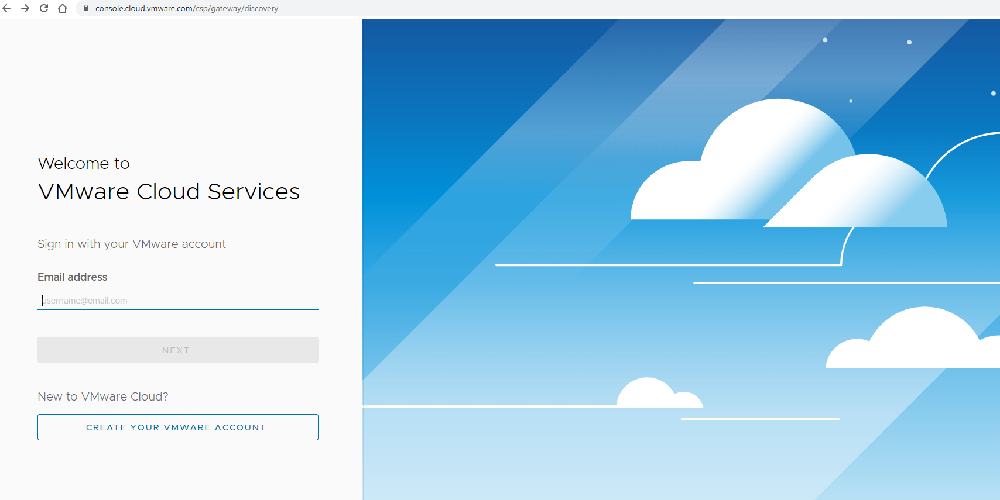
> 
> Navigate to Service Broker-\>Catalog.
> 
> 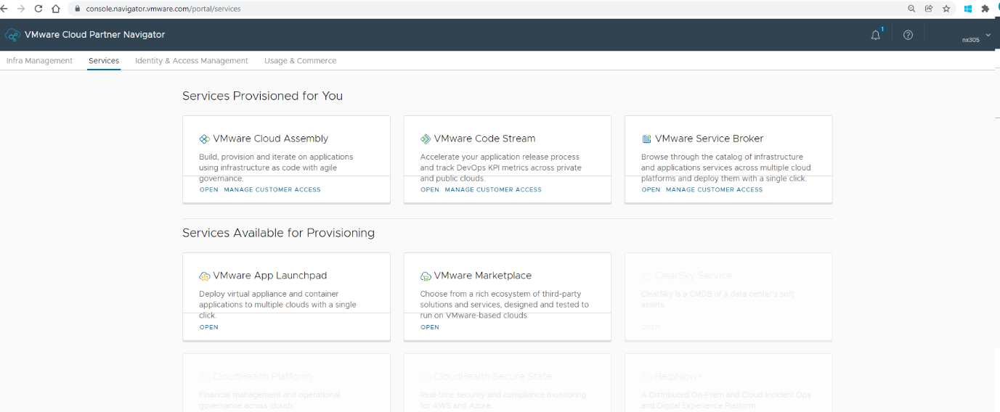
> 
> Make sure proper organization is selected.
> 
> Select Deploy Windows VM Catalog item.
> 
> 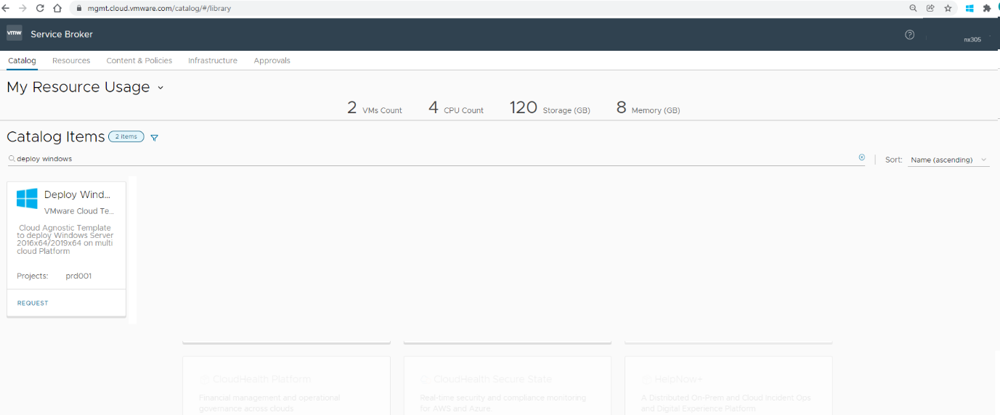

## General tab

  - On this page users can select the required **Cloud Account** (eg.
    DHC, AZURE) where user want to deploy VM.

  - Based on the selected cloud account, additional pages will get
    populated.

  - Additional pages will capture required information for VM
    provisioning on given cloud account.

| **Screenshots** |
| --------------- |
|                 |
| 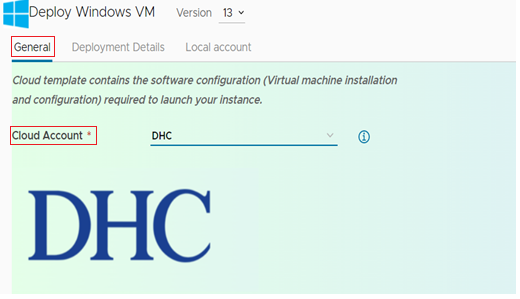 |

## Deployment Details

  - This page will take all the necessary input to deploy the Virtual
    Machine, also user can deploy multiple VMs as per requirement.

  - Form element dropdown value will be populated based on the selection
    of Cloud Account

| **Screenshots**                   |
| --------------------------------- |
|                                   |
|                                   |
| 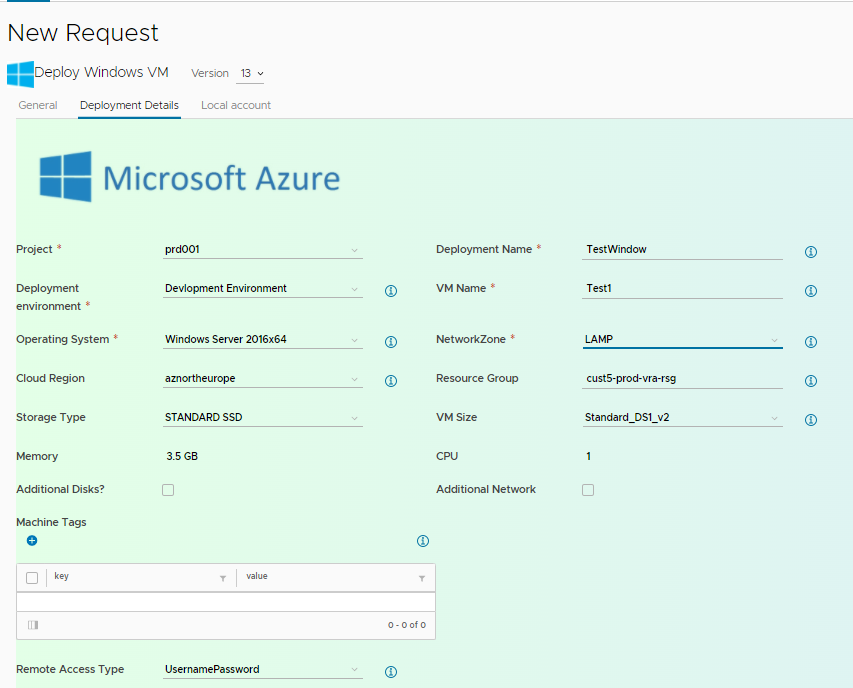|
| 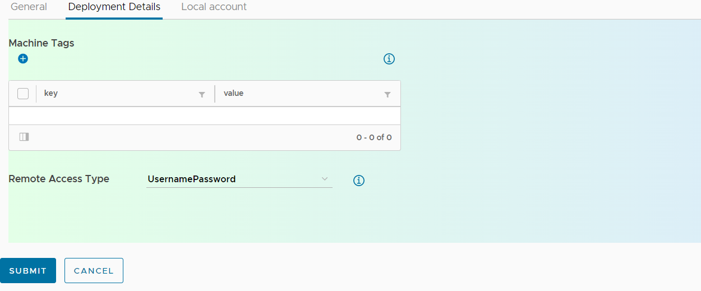 |

<table>
<thead>
<tr class="header">
<th>Field Name</th>
<th>Description</th>
</tr>
</thead>
<tbody>
<tr class="odd">
<td><strong>Project</strong></td>
<td>User need to select project as per contract (eg prd001)</td>
</tr>
<tr class="even">
<td><em><strong>Deployment Environment</strong></em></td>
<td>Based on the roles and requirement User need to select the Environment in which VM will be deployed. The environment can vary according to organization.</td>
</tr>
<tr class="odd">
<td><em><strong>Deployment Name</strong></em></td>
<td>Enter the valid unique deployment name</td>
</tr>
<tr class="even">
<td><em><strong>VM Name</strong></em></td>
<td>Enter any valid name of VM, prefix will be added in backend based on Deployment Environment Eg: <strong>Test-deploymentname.</strong></td>
</tr>
<tr class="odd">
<td><em><strong>No of VMs</strong></em></td>
<td>Users need to enter the no of VMs gets deployed. User can configure the default and maximum limit based on customer requirements; current limit is set to 5</td>
</tr>
<tr class="even">
<td><em><strong>Operating System</strong></em></td>
<td>users need to select the available windows operating system to deploy on the VM e.g., <strong>Windows server 2016x64.</strong> List can be configured according to customers need and templates supported by DHC</td>
</tr>
<tr class="odd">
<td><em><strong>Network Zone</strong></em></td>
<td>users need to select available network zone from the list e.g.: <strong>LAMP</strong>, <strong>SAP</strong>, <strong>TRUSTED</strong>. The Zone names can be customized based on customers requirement.</td>
</tr>
<tr class="even">
<td><em><strong>Cloud Zone</strong></em></td>
<td>users need to select available cloud zone from the list e.g.: <strong>gre3201</strong></td>
</tr>
<tr class="odd">
<td><em><strong>Cluster name</strong></em></td>
<td>
based on the cloud zone cluster name will be automatically populated.

In case if customer have more than 1 cluster in given cluster zone, then this field will have dropdown list accordingly.
</td>
</tr>
<tr class="even">
<td><em><strong>Storage Type</strong></em></td>
<td>users need to select available standard storage type from the list for e.g., available options are <strong>Gold</strong>, <strong>Silver</strong>, <strong>Dimond</strong>. This list can be configured based on customer need.</td>
</tr>
<tr class="odd">
<td><em><strong>VM Size</strong></em></td>
<td>users need to select available standard DHC VM Size from the list for e.g., <strong>Small, Xsmall, medium, Large, XLarge.</strong> Each size has memory and CPU associated with it. Click on Information button for more details.</td>
</tr>
<tr class="even">
<td><em><strong>Memory</strong></em></td>
<td>Based on the VM Size, memory will be populated</td>
</tr>
<tr class="odd">
<td><em><strong>CPU</strong></em></td>
<td>Based on the VM Size, CPU will be populated</td>
</tr>
<tr class="even">
<td><em><strong>Machine Tag</strong></em></td>
<td>Enter the Machine tag with key value pair which will help to find the resource based on tag.</td>
</tr>
<tr class="odd">
<td><em><strong>Additional Disks</strong></em></td>
<td>If user want to add additional disks, user can select the checkbox then new page will be populated to enter the Additional disk info.</td>
</tr>
<tr class="even">
<td><em><strong>Additional Networks</strong></em></td>
<td>If user want to add additional network, user can select the checkbox then new page will be populated to enter the Additional NICk info</td>
</tr>
<tr class="odd">
<td><em><strong>Remote Access Type</strong></em></td>
<td>Here user need to select the way user will login to newly deployed VMs. Eg. <strong>usernamePassword</strong>.</td>
</tr>
</tbody>
</table>

## Local Account

  - This page will let us set the username and password using which user
    will access deployed VMs.

  - Rules for Username and password  
    **username**: anything betuseren 5-12 characters  
    **password**: as per below rule**  
    minLength:** 12  
    **maxLength**: 18  
    **pattern**: '\[a-z0-9A-Z@\#$\]+'

| **Screenshots**                   |
| --------------------------------- |
| 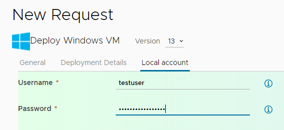 |

## Additonal Disk Details

  - This page takes info to add new disk, to add new disk click on plus
    symbol (**+**) new form will populate to enter below details.

  - **Name of this Disks**: The name of the disk should be unique.

  - **Drive Letter**: user can select available letter from list. Only
    unique letter will be assigned to each drive.

  - **Size in GB**: it should be only in numbers.

  - **Storage Profile**: It will select standard available storage
    profile.

  - **Format Disk** : User will have option to format all additional
    disks at once or to keep disks as it is and format later from within
    OS.

> **Note**: Maximum number of disks will be will visible below the disk
> tables.

| **Screenshots**                   |
| --------------------------------- |
| 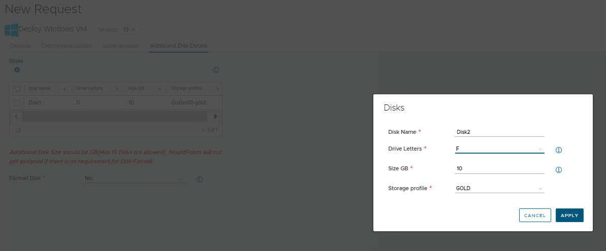 |

## Additional NICs Details

  - This page takes info to add new additional network, to add new
    additional NIC, click on plus symbol (**+**) new form will populate
    to enter below details.

  - **NIC Name**: it should be valid unique name.

  - **Network Profile for Each NIC**: User can select required Profile
    according to their need.

> **Note**: Maximum NIC will be will visible below the NIC tables.

| **Screenshots**                   |
| --------------------------------- |
| 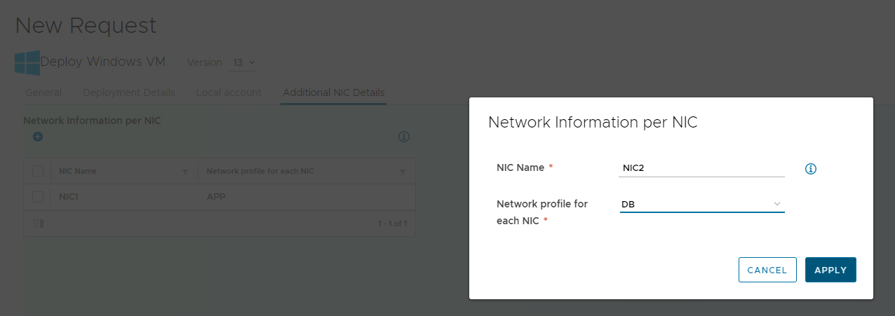 |

# VM Deployment in AZURE Cloud

> The Blueprint catalogue form is multipage form. End users need to
> Navigate each page step by step to provide the required VM
> information.

## General Page

  - This page let user select the **Cloud platform** (eg. DHC, AZURE)
    where they want to deploy the VMs

  - Based on the selected Platform, new page will get populated with
    required input elements for VM Deployment.

| **Screenshots**                    |
| ---------------------------------- |
| 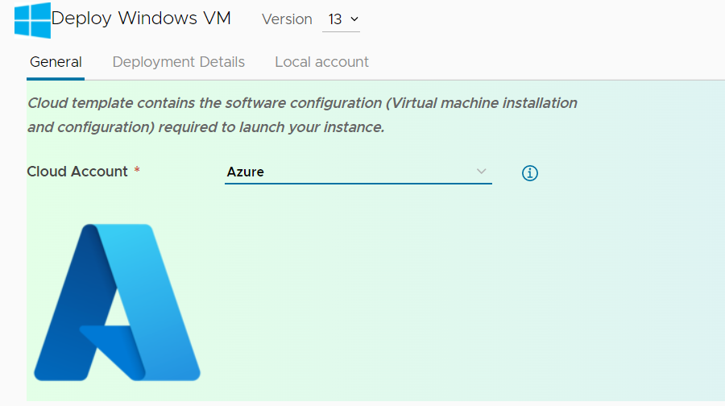 |

## Deployment Details

  - This page will take all the necessary input to deploy the Virtual
    Machine.

  - Below is the required info user need to provide.

  - Form element dropdown value will be populated based on the selection
    of Cloud Account i.e. **Azure**.

| Field Name                   | Description                                                                                                                                                                                                                                                                                                                                                                                                                              |
| ---------------------------- | ---------------------------------------------------------------------------------------------------------------------------------------------------------------------------------------------------------------------------------------------------------------------------------------------------------------------------------------------------------------------------------------------------------------------------------------- |
| **Project**                  | Users need to select project as per contract (eg prd001)                                                                                                                                                                                                                                                                                                                                                                                 |
| ***Deployment Environment*** | Based on the roles and requirement User need to select the Environment in which VM will be deployed. The environment can vary according to organization.                                                                                                                                                                                                                                                                                 |
| ***Deployment Name***        | Enter the valid unique deployment name                                                                                                                                                                                                                                                                                                                                                                                                   |
| ***VM Name***                | Enter any valid name of VM, prefix will be added in backend based on Deployment Environment Eg: **Test-deploymentname.**                                                                                                                                                                                                                                                                                                                 |
| ***Operating System***       | users need to select the available windows operating system to deploy on the VM eg **Windows server 2016x64.** List can be configured according to customers need and as per subscription with Azure                                                                                                                                                                                                                                     |
| ***Network Zone***           | users need to select available network zone from the list e.g: **LAMP**, **SAP**, **TRUSTED**. The Zone names can be customized based on customer requirement.                                                                                                                                                                                                                                                                           |
| ***Storage Type***           | users need to select available standard azure storage type from the list for eg **Standard SSD**, **Standard HDD**, **BLOB.** This list can be configured based on customer need.                                                                                                                                                                                                                                                        |
| ***VM Size***                | users need to select available standard azure VM Size from the list for eg **Standard\_DS1\_V2**, **Standard\_F2s\_V2.** Each size has memory and CPU associated with it. the standard azure VM sizes SKUs are available for a particular subscription in azure depending upon any policy or limit set for that subscription. Please check your azure subscription for available VM sizes and modify the vRA list of images accordingly. |
| ***Memory***                 | Based on the VM Size memory will be populated                                                                                                                                                                                                                                                                                                                                                                                            |
| ***CPU***                    | Based on the VM Size, CPU will be populated                                                                                                                                                                                                                                                                                                                                                                                              |
| ***Machine Tag***            | Enter the Machine tag with key value pair which will help us to find the resource based on tag.                                                                                                                                                                                                                                                                                                                                          |
| ***Resource Group***         | users need to choose the resource group under which user need to deploy the VM                                                                                                                                                                                                                                                                                                                                                           |
| ***Cloud Region***           | Select appropriate cloud region.                                                                                                                                                                                                                                                                                                                                                                                                         |
| ***Additional Disks***       | If user want to have additional disks, user can select the checkbox then new page will be populated to enter the Additional disk info.                                                                                                                                                                                                                                                                                                   |
| ***Additional Networks***    | If user want to have additional network, user can select the checkbox then new page will be populated to enter the Additional NICk info                                                                                                                                                                                                                                                                                                  |
| ***Remote Access Type***     | ***:*** Here user need to select the way user will login newly deployed VMs. Eg. **usernamePassword**.                                                                                                                                                                                                                                                                                                                                   |

| **Screenshots**                    |
| ---------------------------------- |
|  |

## Local Account

  - This page will let us set the username and password using which user
    will access deployed VMs.

  - Rules for Username and password  
    **username**: anything betuseren 5-12 char  
    **password**: anything according to below rule**  
    minLength:** 12  
    **maxLength**: 18  
    **pattern**: '\[a-z0-9A-Z@\#$\]+'

| **Screenshots**                    |
| ---------------------------------- |
| 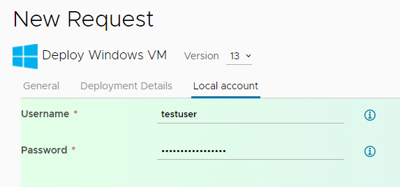 |

## Additonal Disk Details

  - This page takes info to add new disk, to add new disk click on plus
    symbol (**+**) new form will populate to enter below details.

  - **Size in GB**: it should be only numbers.

  - **Name of this Disks**: The name should be unique.

  - **Storage Profile**: It will let select standard available storage
    profile.

> **Note**: Maximum number of disks will be will visible below the disk
> tables.

| **Screenshots**                    |
| ---------------------------------- |
| 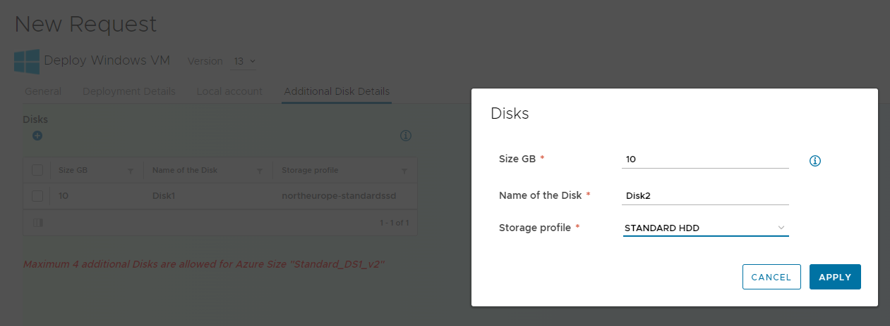 |

## Additional NICs Details

  - This page takes info to add new additional network, click on plus
    symbol (**+**) new form will populate to enter below details.

  - **NIC Name**: it should be valid unique name.

  - **Network Profile for Each NIC**: User can select required Profile
    according to our need.

> **Note**: Maximum NIC will be will visible below the NIC tables.

| **Screenshots**                    |
| ---------------------------------- |
| 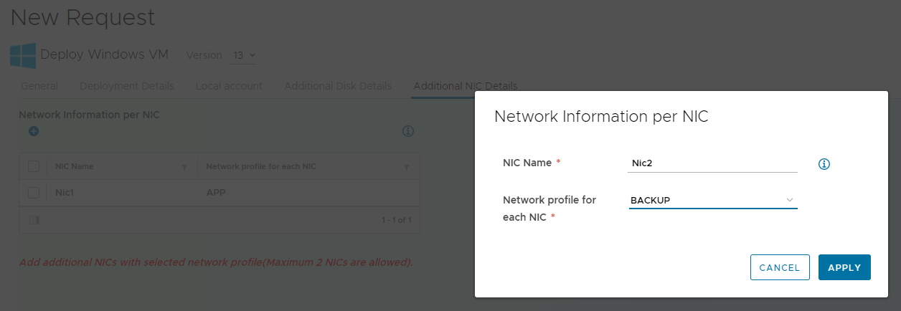 |

## Form Validation

  - After providing the required information, user need to click on
    submit button to deploy the VM. But before deployment starts it will
    validate below provided info, if provided information is proper then
    it will start deploying and redirect us to deployment page otherwise
    it will show validation massage on the top of form.

  - Below Form element will be verified before submitting the Blueprint
    info.  
    **Additional Disk:** Additional disk can’t be more the specified
    limit.  
    **Additional NICs:** Additional NICs can’t be more than specified
    NICs.

| **Screenshots**                    |
| ---------------------------------- |
| 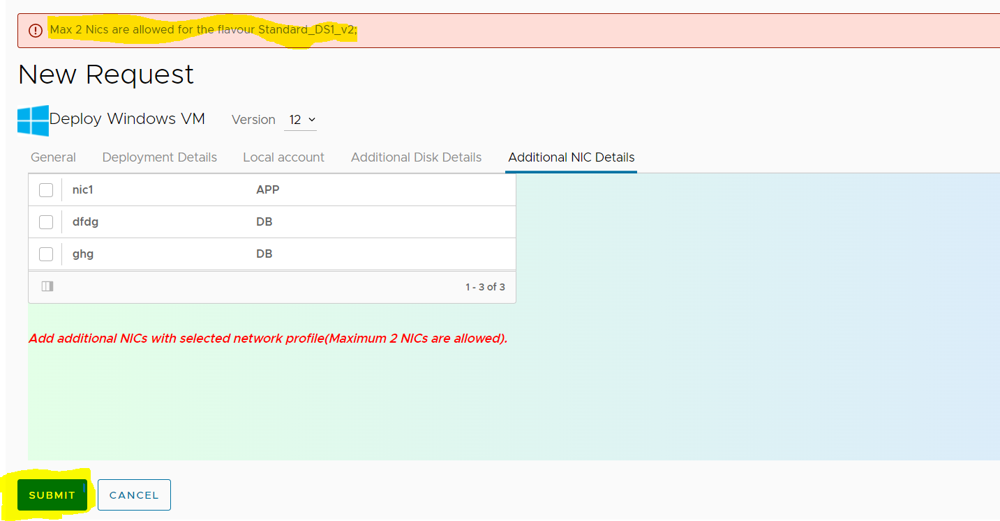 |
